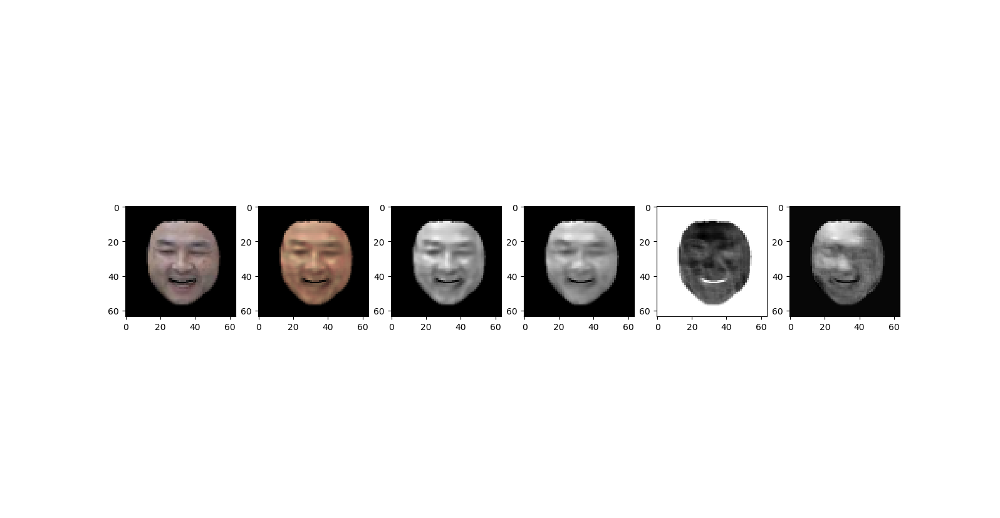

# BioFace_pytorch


### validation result 

RMSE on reconstructed celeba image
 * epoch 1: 3919.34
 * epoch 2: 50.11836574980213
 * epoch 3: 32.7918787119725
 * epoch 4: 14.27214661448984
 * epoch 5: 12.689056576542079


### training checkpoints

The training checkpoints can be downloaded here: [[Google drive](https://drive.google.com/file/d/1sTqQgo0eLaPX8ND7Mk51KymuzeJIUeNn/view?usp=sharing)]

Unzip the file you will find 5 model weights

* model_scale_image.pth     --- after epoch 1
* model_scale_image_1.pth   --- after epoch 2
* model_scale_image_2.pth   --- after epoch 3
* model_scale_image_3.pth   --- after epoch 4
* model_scale_image_4.pth   --- after epoch 5

### training and validation data 

training and validation data can be found here:
[[Google Drive](https://drive.google.com/drive/folders/1UMiaw36z2E1F-tUBSMKNAjpx0o2TePvF?usp=sharing)]

download the files named zx_7_d10_inmc_celebA_X.hdf5 where X = [1,2,3,4,5,20]. Here we use 1,2,3,4,5 as training set and 20 as validation set. 


### instruction to run

Make sure you installed torch == 1.8.1 in your environment and have a working gpu and cuda installed

To train from scratch:
* set `load_path` in main.py to None
* make sure `data_folder_name` points to the directory with celeba h5py files
* set other parameters accordingly
* uncomment the `train(....)` line in the __main__ body 
* comment all other lines in the __main__ body
* run ```python main.py``` in the terminal

To test with celaba dataset:
* set `load_path` in main.py to the model that you want to load from
* uncomment the `test(....)` line in the __main__ body
* comment all other lines in the __main__ body
* run ```python main.py``` in the terminal

To visualise the testing result:
* set `load_path` in main.py to the model that you want to load from
* uncomment the `test_one_image(...)` line in the __main__ body
* comment all other lines in the __main__ body 
* run ```python main.py``` in the terminal

### Visualization example



From left to right the images are:
original image, reconstructed image, diffuse shading map, specular shading map, melanin map, heamoglobin map

### Notes:
* The project is trained on cpu and the execution on cpu might encounter some problem
* Seemed to flipped melanin map and heamoglobin map in the bio to physical model given the output result. 
* Can be trained more but due to limited time and computation resources it didn't happen. 

### Citation

This work is based on the paper "BioFaceNet: Deep Biophysical Face Image Interpretation". The original implementation in github can be found [here](https://github.com/ssma502/BioFaces)

